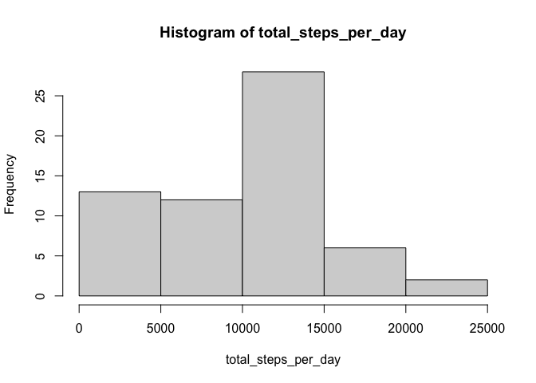
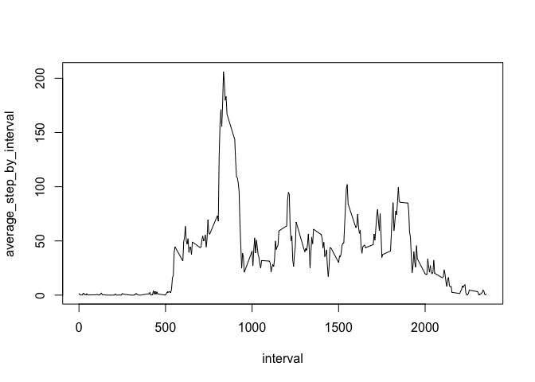
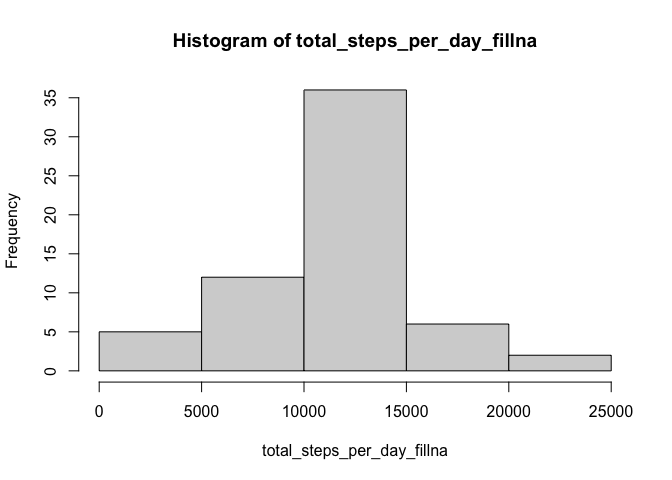

## Loading and preprocessing the data


```r
data <- read.csv("activity.csv")
str(data)
```

```
## 'data.frame':	17568 obs. of  3 variables:
##  $ steps   : int  NA NA NA NA NA NA NA NA NA NA ...
##  $ date    : chr  "2012-10-01" "2012-10-01" "2012-10-01" "2012-10-01" ...
##  $ interval: int  0 5 10 15 20 25 30 35 40 45 ...
```

```r
data$date <- as.Date(data$date)
summary(data)
```

```
##      steps             date               interval     
##  Min.   :  0.00   Min.   :2012-10-01   Min.   :   0.0  
##  1st Qu.:  0.00   1st Qu.:2012-10-16   1st Qu.: 588.8  
##  Median :  0.00   Median :2012-10-31   Median :1177.5  
##  Mean   : 37.38   Mean   :2012-10-31   Mean   :1177.5  
##  3rd Qu.: 12.00   3rd Qu.:2012-11-15   3rd Qu.:1766.2  
##  Max.   :806.00   Max.   :2012-11-30   Max.   :2355.0  
##  NA's   :2304
```


## What is mean total number of steps taken per day?


```r
total_steps_per_day <- tapply(data$steps,data$date,sum,na.rm=TRUE)
hist(total_steps_per_day)
```

<!-- -->

```r
mean(total_steps_per_day)
```

```
## [1] 9354.23
```

```r
median(total_steps_per_day)
```

```
## [1] 10395
```
## What is the average daily activity pattern?

```r
average_step_by_interval <- tapply(data$steps,data$interval,mean,na.rm=TRUE)
plot(x=names(average_step_by_interval),y=average_step_by_interval,type='l',xlab = 'interval')
```

<!-- -->

```r
names(which.max(average_step_by_interval))
```

```
## [1] "835"
```


## Imputing missing values
1. the total number of missing values in the dataset

```r
sum(is.na(data$steps))
```

```
## [1] 2304
```
2. filling in all of the missing values in the dataset with the mean for that 5-minute interval
3. Create a new dataset that is equal to the original dataset but with the missing data filled in.

```r
library(dplyr)
steps_fillna <- data$steps
steps_fillna[is.na(data$steps)] <- average_step_by_interval[
      as.character(data$interval[is.na(data$steps)])] 
data_fillna <- mutate(data,steps = steps_fillna)
head(data_fillna)
```

```
##       steps       date interval
## 1 1.7169811 2012-10-01        0
## 2 0.3396226 2012-10-01        5
## 3 0.1320755 2012-10-01       10
## 4 0.1509434 2012-10-01       15
## 5 0.0754717 2012-10-01       20
## 6 2.0943396 2012-10-01       25
```
4. Make a histogram of the total number of steps taken each day and Calculate and report the mean and median total number of steps taken per day. 
- Do these values differ from the estimates from the first part of the assignment? Yes.
- What is the impact of imputing missing data on the estimates of the total daily number of steps? Different strategies would affect the result differently. My strategy raised the total steps per day and wiped out the discrepancy between the mean and the median.


```r
total_steps_per_day_fillna <- tapply(data_fillna$steps,data_fillna$date,sum,na.rm=TRUE)
hist(total_steps_per_day_fillna)
```

<!-- -->

```r
mean(total_steps_per_day_fillna)
```

```
## [1] 10766.19
```

```r
median(total_steps_per_day_fillna)
```

```
## [1] 10766.19
```

## Are there differences in activity patterns between weekdays and weekends?

1. Create a new factor variable in the dataset with two levels – “weekday” and “weekend” indicating whether a given date is a weekday or weekend day.
2. Make a panel plot containing a time series plot (i.e. \color{red}{\verb|type = "l"|}type = "l") of the 5-minute interval (x-axis) and the average number of steps taken, averaged across all weekday days or weekend days (y-axis). See the README file in the GitHub repository to see an example of what this plot should look like using simulated data.

```r
library(ggplot2)
data_fillna <- mutate(data_fillna,
                      daytype = ifelse(
                            weekdays(data_fillna$date,abbreviate=TRUE) %in% c("Sat","Sun"),
                            "Weekend","Weekday")
                      )

average_step_daytype <- summarise(
      group_by(data_fillna,interval,daytype),
      steps = mean(steps)
)
ggplot(data = average_step_daytype,aes(interval,steps)) + 
      geom_line() + 
      facet_grid(daytype~.)
```

<!-- -->

